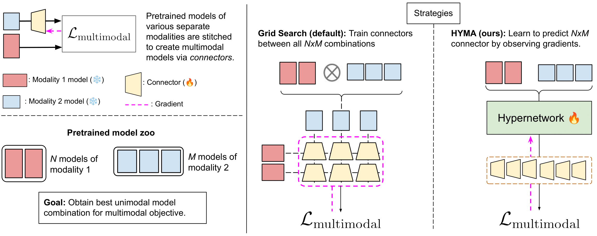

<div align="center">

# (Almost) Free Modality Stitching of Foundation Models

Jaisidh Singh $^{1,2,4}$, Diganta Misra $^{3,4}$, Boris Knyazev $^{5}$, Antonio Orvieto $^{3,4,6}$

$^1$ University of Tübingen, $^2$ Zuse School ELIZA, $^3$ ELLIS Institute Tübingen, $^4$ MPI-IS Tübingen, $^5$ SAIT AI Lab Montréal, $^6$ Tübingen AI Center 

<a href="https://arxiv.org/pdf/2507.10015"></a>
<a href="./LICENSE"></a>

### Abstract

Foundation multi-modal models are often designed by stitching of multiple existing pretrained uni-modal models: for example, an image classifier with an text model. This stitching process is performed by training a connector module that aims to align the representation spaces of these uni-modal models towards a multi-modal objective. However, given the complexity of training such connectors on large scale web-based datasets coupled with the ever-increasing number of available pretrained uni-modal models, the task of uni-modal models selection and subsequent connector module training becomes computationally demanding. To address this under-studied critical problem, we propose Hypernetwork Model Alignment (Hyma), a novel all-in-one solution for optimal uni-modal model selection and connector training by leveraging hypernetworks. Specifically, our framework utilizes the parameter prediction capability of a hypernetwork to obtain jointly trained connector modules for $N\times M$ combinations of uni-modal models. In our experiments, Hyma reduces the cost of searching for the best performing uni-modal model pair by $10\times$, while matching the ranking and trained connector performance obtained via grid search across a suite of diverse multi-modal benchmarks.


</div>

<br>
This repositories releases the data used to train a generative model of multi-modal connectors as well as the checkpoints of the multi-modal connectors presented in the paper "(Almost) Free Modality Stitching of Foundation Models".


## Checkpoints

The checkpoints of $\text{MLP}_1$ connectors for VLMs obtained via our method HYMA and Grid Search are uploaded to <a href="https://huggingface.co/collections/jaisidhsingh/hyma-vlm-connector-checkpoints-68a34befaad027913f605c81">here</a>. Note that we upload the connectors for the best performing encoder pairs, of feature dimension 1024 and 768 (for both image and text). Each `.pt` filename provides the description of the image encoder and text encoder aligned via the connector.

An easy way to load the connector checkpoint for the corresponding VLM is to use the `get_vlm_from_checkpoint` function in `utils.py` as
```python
from vlm import get_vlm_from_checkpoint

checkpoint_path = "vit_l16_mlp1_mpnet.pt"
model = get_vlm_from_checkpoint(checkpoint_path)
print(model)
```

This returns a `CustomVLM` object, which is defined as
```python
import timm
import torch
from typing import *
import torch.nn as nn
import torch.nn.functional as F
from upload_data import ie_name_maps, te_name_maps
from sentence_transformers import SentenceTransformer


class ImageEncoder(nn.Module):
    def __init__(self, model_name, device="cuda"):
        super().__init__()
        self.model_name = model_name
        self.device = device

        self.model = timm.create_model(self.model_name, pretrained=True, num_classes=0)
        self.config = timm.data.resolve_model_data_config(self.model)
        self.model = self.model.to(self.device)
        self.model.eval()
        self.transform = timm.data.create_transform(**self.config, is_training=False)

    def encode_image(self, image):
        image_features = self.model(image)
        return F.normalize(image_features, dim=-1)

    def forward(self, image):
        return self.encode_image(image)


class TextEncoder():
    def __init__(self, model_name, device="cuda"):
        self.model_name = model_name
        self.device = device

        self.model = SentenceTransformer(model_name).to(device)
        self.model.eval()

    def to(self, x):
        self.model.to(x)

    def __call__(self, x):
        return self.encode_text(x)

    def encode_text(self, sentences):
        text_features = self.model.encode(sentences)
        text_features = torch.from_numpy(text_features).to(self.device)
        return F.normalize(text_features, dim=-1)


def init_modality_connector(input_dim, hidden_dims, output_dim, activation="relu"):
    if activation == "relu":
        act_fn = nn.ReLU()
    elif activation == "gelu":
        act_fn = nn.GELU()
    
    num_layers = len(hidden_dims) + 1
    layer_dims = [input_dim] + hidden_dims + [output_dim]
    layers = [nn.Linear(input_dim, layer_dims[1])]
    
    for i in range(0, num_layers):
        if i % 2 != 0:
            layers.append(act_fn)
        layers.append(nn.Linear(layer_dims[i], layer_dims[i+1]))
    
    return nn.Sequential(*layers)


class CustomVLM():
    def  __init__(self, image_encoder_name, text_encoder_name, connector_args=None, device="cuda"):
        self.image_encoder = ImageEncoder(image_encoder_name)
        self.image_encoder.model = self.image_encoder.model.to(device)

        self.text_encoder = TextEncoder(text_encoder_name)
        self.text_encoder.model = self.text_encoder.model.to(device)

        self.connector = None
        if connector_args is not None:
            self.connector = init_modality_connector(*connector_args).to(device)
            self.connector.eval()
        
        self.device = device
    
    def load_connector_checkpoint(self, checkpoint_path):
        checkpoint = torch.load(checkpoint_path, map_location=self.device, weights_only=True)
        self.connector.load_state_dict(checkpoint)

    def encode_image(self, x):
        return self.image_encoder.encode_image(x)

    def encode_text(self, x):
        x = self.text_encoder.encode_text(x)
        if self.connector is not None:
            x = self.connector(x)
        return x

```

## Pre-emebedded CC3M-558K dataset

We embed the samples of CC3M-558K (in-order) across 9 image encoders and 3 text encoders, normalize all embeddings, and upload them <a href="https://huggingface.co/collections/jaisidhsingh/hyma-llava-alignment-cc3m-558k-pre-embedded-68a34597f1e8d93e2a40c8b4">here</a>. Each `.pt` filename provides the description of the model for embedding. A PyTorch dataset can be created after loading the embeddings to train your custom connectors as
```python
from torch.utils.data import Dataset, DataLoader

class EmbeddingDataset(Dataset):
    def __init__(self, filepath):
        # For example: `vit_s16.pt` from the huggingface dataset `jaisidhsingh/cc3m558k-img-embed-dim-384` 
        self.embeddings = torch.load(filepath, weights_only=False, map_location="cpu")
        self.embed_dim = self.embeddings.shape[-1]

    def __len__(self):
        return len(self.embeddings)

    def __getitem__(self, idx):
        return self.embeddings[idx]

dataset = EmbeddingDataset("jaisidhsingh/cc3m558k-img-embed-dim-384/vit_s16.pt")
dataloader = DataLoader(dataset, batch_size=16384, pin_memory=True) # since these are just vectors, batch size can be large 
```

## Citation

If you found our work useful, please cite our paper as
```bib
@article{singh2025almost,
  title={(Almost) Free Modality Stitching of Foundation Models},
  author={Singh, Jaisidh and Misra, Diganta and Knyazev, Boris and Orvieto, Antonio},
  journal={arXiv preprint arXiv:2507.10015},
  year={2025}
}
```